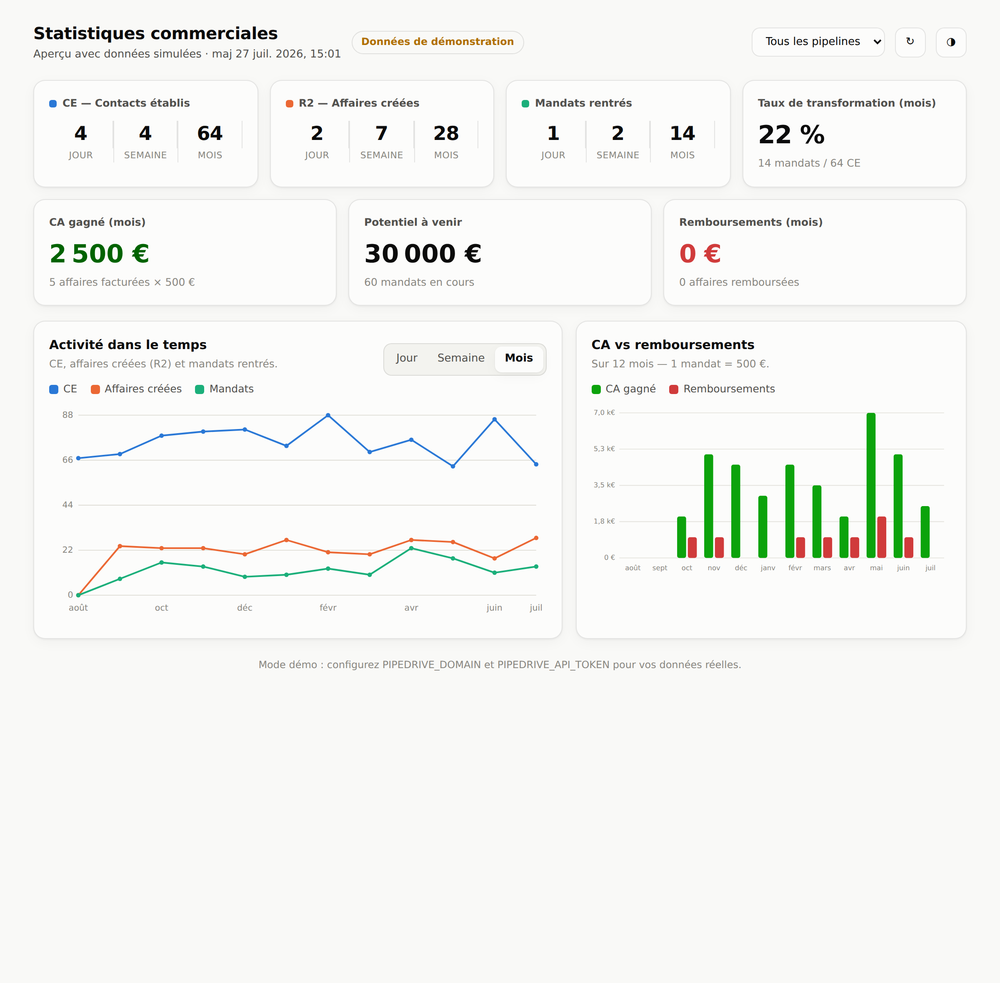

# Statistiques commerciales · Pipedrive

Webapp simplifiée reliée à **Pipedrive (API v2)** pour suivre en un coup d'œil ton activité commerciale (activité de mandataire) : contacts établis, affaires créées, mandats rentrés, taux de transformation, chiffre d'affaires, potentiel et remboursements.

Ton **token API reste secret** : il n'est utilisé que par un petit backend (fonction serverless), jamais exposé au navigateur.



## Les KPIs affichés

| Indicateur | Définition |
|---|---|
| **CE — Contacts établis** | Activités *appel* dont le champ « résultat d'appel » = « Contact établi ». Compté par **jour / semaine / mois**. |
| **R2 — Affaires créées** | Affaires créées (date de création). Par jour / semaine / mois. |
| **Mandats rentrés** | Affaires dont le champ date « règlement mandat » est renseigné (comptées à cette date). Par jour / semaine / mois. |
| **Taux de transformation** | Mandats du mois ÷ CE du mois. |
| **CA gagné (mois)** | Nombre d'affaires *facturées* (gagnées) dans le mois × 500 €. |
| **Potentiel à venir** | Affaires *en cours* ayant une date de règlement mandat × 500 €. |
| **Remboursements (mois)** | Affaires *perdues* ayant une date de règlement mandat, comptées au mois × 500 €. |

Correspondance métier : *affaire gagnée = facturé*, *affaire perdue = remboursé ou pas de projet*, *affaire en cours avec date de règlement mandat = potentiel*. Un filtre **multi-pipelines** et un **thème clair/sombre** sont disponibles.

## Étape 1 — Découvrir la structure de ton Pipedrive (chez toi)

Les étapes et champs personnalisés ont des identifiants uniques (clés hashées) qu'il faut récupérer une fois. Le script de découverte le fait ; **ton token reste sur ta machine**.

```bash
cp .env.example .env
# Renseigne PIPEDRIVE_DOMAIN et PIPEDRIVE_API_TOKEN dans .env
node scripts/discover.js
```

Il affiche un résumé lisible : la liste de tes **pipelines** (+ IDs), tes **champs date d'affaire** (pour trouver « règlement mandat »), tes **champs de résultat d'appel** avec les **IDs d'options** (pour trouver « Contact établi »), et tes **types d'activité**. Le détail complet est écrit dans `discover-output.json`.

## Étape 2 — Renseigner le mapping

À partir de la sortie du script, complète dans `.env` (ou dans un `config.json`, voir `config.example.json`) :

```bash
PIPEDRIVE_MANDAT_DATE_FIELD=<key du champ date règlement mandat>
PIPEDRIVE_CE_FIELD=<key du champ résultat d'appel>
PIPEDRIVE_CE_VALUES=<option id de "Contact établi">
PIPEDRIVE_CE_ACTIVITY_TYPES=call      # optionnel
PIPEDRIVE_PIPELINES=                  # optionnel : IDs à inclure, vide = tous
```

## Étape 3 — Lancer

```bash
node dev-server.js        # http://localhost:3000
```

Sans token ou mapping incomplet, l'app démarre en **mode démo** (données simulées) pour voir le rendu tout de suite.

## Déploiement en ligne (Vercel — recommandé, gratuit)

1. Pousse ce dossier sur GitHub (ou utilise la CLI `vercel`).
2. Sur [vercel.com](https://vercel.com) → **New Project** → importe le dépôt (aucun réglage de build).
3. **Settings → Environment Variables** : ajoute `PIPEDRIVE_DOMAIN`, `PIPEDRIVE_API_TOKEN`, puis le mapping (`PIPEDRIVE_MANDAT_DATE_FIELD`, `PIPEDRIVE_CE_FIELD`, `PIPEDRIVE_CE_VALUES`, éventuellement `PIPEDRIVE_CE_ACTIVITY_TYPES`, `PIPEDRIVE_PIPELINES`).
4. **Deploy**. Ton dashboard est en ligne.

## Tester les calculs

```bash
node test/stats.test.js   # ou npm test
```

## Sécurité

- Le token vit uniquement en variable d'environnement côté serveur ; il n'apparaît jamais dans le navigateur.
- `.env`, `config.json` et `discover-output.json` sont ignorés par git (`.gitignore`).
- L'endpoint `/api/stats` ne renvoie que des agrégats, pas la liste brute des affaires.

## Structure

```
api/
  _pipedrive.js   Appels API Pipedrive (v2 données, v1 définitions de champs), token serveur
  _config.js      Mapping métier <-> champs Pipedrive (env ou config.json)
  _stats.js       Calcul des KPIs (fonctions pures)
  _demo.js        Données de démonstration
  stats.js        Endpoint GET /api/stats
scripts/
  discover.js     Découverte de la structure Pipedrive (à lancer en local)
public/
  index.html      Dashboard (HTML/CSS/JS, graphiques SVG sur-mesure)
dev-server.js     Serveur local (sans Vercel)
test/stats.test.js Tests des calculs
config.example.json / .env.example  Modèles de configuration
```

## Notes techniques

- Données via l'**API Pipedrive v2** (`/api/v2/...`, pagination par curseur). Les définitions de champs utilisent les endpoints `/v1/*Fields` (non concernés par le retrait des endpoints de données v1 le 31/07/2026). Token passé via l'en-tête `x-api-token`.
- Les périodes (jour/semaine/mois) sont calculées sur le calendrier UTC ; un léger décalage est possible aux frontières de minuit selon le fuseau.
- CA, potentiel et remboursements reposent sur la règle **1 mandat = 500 €** (`PIPEDRIVE_MANDAT_VALUE` pour changer).
